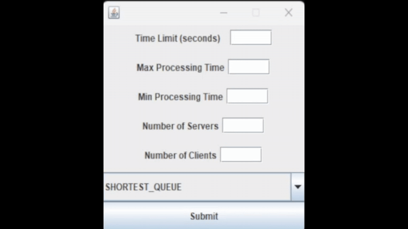
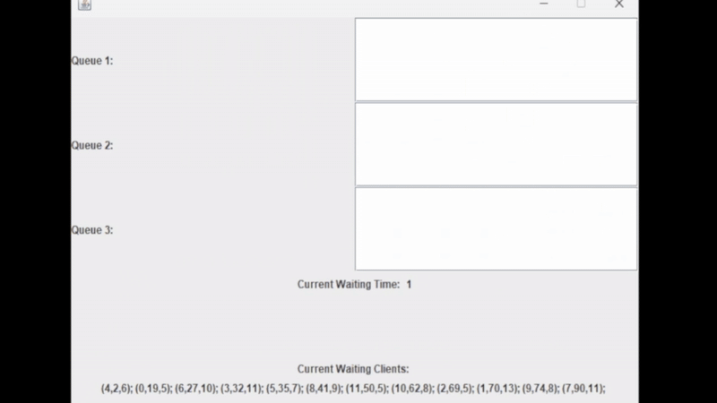

# **Task Scheduling Simulation**

## **Overview**
This project simulates a task scheduling system where multiple servers process incoming tasks using different scheduling strategies. 
The simulation includes a very simple GUI for visualization.

There are 2 main scheduling policies:

- **Shortest Queue**: Assigns the new task to the server with the fewest tasks.
- **Shortest Time**: Assigns the new task to the server with the least total processing time.

## **Features**
- Multiple servers running in parallel as separate threads.
- Task allocation using different scheduling strategies.
- Real-time GUI visualization.
- Logging of simulation events and statistics.
- Customizable simulation parameters (e.g., number of servers, clients, processing time limits).

## **Project Structure**
It is divided in 3 main packages:
```
      ___________
     /          /|
    / Business / |
   /__________/  |
   |         |  |
   | Logic   | /
   |_________|/

      ___________
     /         /|
    /  Model  / |
   /_________/  |
   |        |  |
   |        | /
   |________|/

      ___________
     /        /|
    /   GUI  / |
   /_______ /  |
   |      |  |
   |      | /
   |______|/

```

## **Installation and Usage**
1. Clone this repository:
   ```sh
   git clone https://github.com/Simi445/MultiThreaded-Queueing.git
   ```
2. Open the project in an IDE like IntelliJ IDEA or Eclipse.
3. Compile and run `SimulationManager.java` to start the simulation.

## **How It Works**
- **Task Creation:** The system generates random tasks with different arrival times and service durations.
- **Task Allocation:** Tasks are distributed among servers based on the selected scheduling policy.
- **Processing:** Each server processes tasks concurrently, reducing their service time step by step.
- **Completion:** Once all tasks are processed, the simulation calculates statistics like average waiting time and peak processing times.

## **Customization**
You can modify parameters in `SimulationManager.java` to control:
- `numberOfServers`: Adjusts the number of servers.
- `numberOfClients`: Sets the number of tasks.
- `timeLimit`: Defines the simulation duration.
- `minProcessingTime` & `maxProcessingTime`: Control task duration.
- `strategy`: Select between `SHORTEST_QUEUE` and `SHORTEST_TIME`.

## **Showcase**
### The Settings configuration
A demonstration of the parameters that can be modified:



---

### The Walktrough of the Application
An incremental showcase on how the queuing works.
The information is organised in tuples, each having the following format: *(id,join_time,process_time)*


